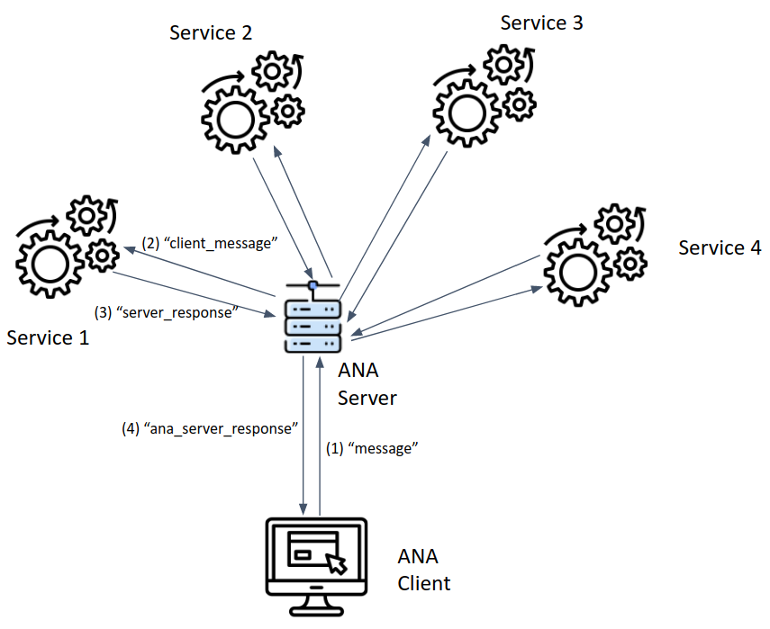

# ANA Architecture

## Introduction

We are using Node.js (https://nodejs.org/en/about/) as main javascript framework and socket.io (https://socket.io/) for communication. It works with Node.js and Python and probably other languages too. 

socket.io provides a websocket implementation that is uses communication channels with unique names, every part of the application can listen and write to.

Here's a description of important files and other things to know:

- index.html: Website with connections to the main socket channels "message" (send messages from the chatbox to the server) and "ana_server_response" (from the ANA server, typically forwarded from the actual services).
- index.js: ANA server. Connects to all services and forwards messages. Channels: "message" (receive messages from the website) and "server_response" (receive responses from the services). Messages from the website are forwarded to the services using the "client_message" channel and responses from the services are forwarded to the website through the "ana_server_response" channel (using the socket id from the website the original message came from).
- styles.css: CSS file for the main parts of the website.
- services_client/: Directory for CSS and JS files for each service (Michael uses kgp.css and kgp.js). Please put your files in there too without any new directories (we may rearrange later if it gets too big).
- basic_service.py: Basic python service.

This is the main architecture. Services can be added and removed easily.

This is the workflow for messages (JSON) from the chatbox on the website (including channel names as used in the code):

(1) Message from the website (index.html) to the server (index.js).

(2) ANA server forwards messages received from the client to all services (socket.emit() for sending it to everybody listening to this channel).

(3) Services respond through the "server_response" channel.

(4) Response to website with socket id. This socket id is stored in the message json and always forwarded, therefore it can be used here.

## Create new service

1. In order to create a new service, check out basic_service.py. Create your own repository and use this piece of code to communicate with the server. Your service has to run separately from the ANA server/client (no additional code necessary; this file will run as-is).
2. You need to add your own Tab (within \
) to display your responses (apart from the message within the response, which is always displayed in the chatbox). Add a CSS/JS files within the services_client folder if needed.
3. Your service is supposed to return a message to the ANA server (index.js; no changes necessary here), which forwards the message to the website using the "ana_server_response" channel. Here you have to check for messages from your service (add service name) and deal with the response.

The main thing here is to make things work somehow, even though it may not be pretty. To make it look nice, we can figure it out together.

Run the server with "npm run start" (this may have to be installed, e.g. see this: https://linuxize.com/post/how-to-install-node-js-on-ubuntu-20-04/) and open the website (http://localhost:3000). Your service should be running too. Send a message to see if it works.

## Requirements

This list may not be exhaustive, but it should be straighforward to fix any issues.

1. pip install python-socketio[client]
2. sudo apt install npm
3. npm install express

## Features missing / things to fix

- Right now there is no database to keep track of the communication and services responses, but it may be relevant.
- Once the database is available we could add a channel where services can ask for previous data, e.g. when they were restarted and lost track of everything.
- Selector for which services should be used (maybe one of them is broken and we want to turn it off).
- Setup everything on ANA0.
- Create login page, we don't want this to be public for now.

Feel free to add whatever you can thing of! (and maybe fix/add whatever you feel comfortable with...)